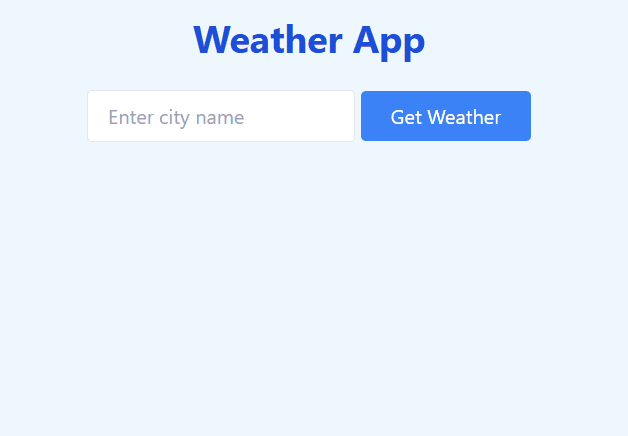

# Weather App – Open-Meteo Edition

A responsive weather app that fetches live weather data using the free Open-Meteo API. The user can check the current temperature, wind speed, and time for any city in the world.

Users can:
- Enter a city name
- View current temperature, wind speed, and local time
- Get feedback for loading, errors, or unknown cities

---

## Table of contents

- [Overview](#overview)
  - [Screenshot](#screenshot)
  - [Links](#links)
- [My Process](#my-process)
  - [Built With](#built-with)
  - [What I Learned](#what-i-learned)
- [Credits](#credits)
- [Author](#author)

---

## Overview

### Screenshot

The weather app in action:

---

### Links

- [GitHub Repo](https://github.com/Lasse-Rodal/Weather-App)
- [Live Demo](https://lasse-rodal.github.io/Weather-App/)

---

## My Process

### Built With

- **Semantic HTML5**
- **Tailwind CSS**
- **Vanilla JavaScript**
  - `async/await` API calls
  - Open-Meteo Geocoding + Forecast APIs
  - DOM updates and error handling

---

### What I Learned

In this project, I practiced:

- Working with chained API calls using `async/await`
- Handling user input and form validation
- Using Open-Meteo’s geolocation search to get lat/lon coordinates
- Styling with Tailwind via CDN
- Improving UX with loading states, error feedback, and structured results

---

## Credits

### API
- Weather data provided by [Open-Meteo](https://open-meteo.com/)

### Styling
- UI styled with [Tailwind CSS](https://tailwindcss.com/)

---

## Author

- GitHub – [Lasse Rodal Pedersen](https://github.com/Lasse-Rodal)
